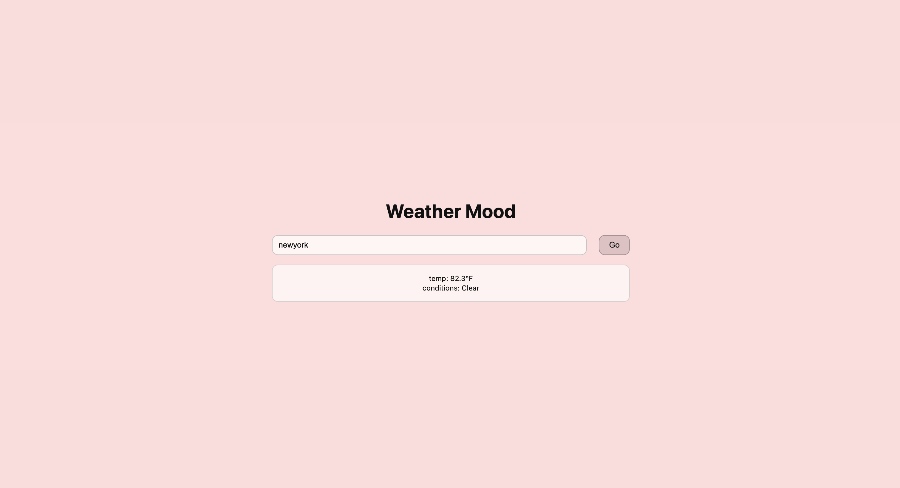

# Weather Mood

Weather Mood is a simple web application that changes the background color of the page based on the current temperature of a city.

Users can type a city name, and the app will fetch real-time weather data using a Web API.

---

## Screenshot



---

## Features

- Search weather by city
- Fetch live weather data from an API
- Background color changes based on temperature
- Display temperature and weather conditions

---

## Example Code

This project uses a weather API request to get data.

```javascript
async function fetchWeather(location){
  const url =
    `https://weather.visualcrossing.com/VisualCrossingWebServices/rest/services/timeline/${location}?unitGroup=us&key=API_KEY&contentType=json`;

  const res = await fetch(url);
  const data = await res.json();
  return data;
}